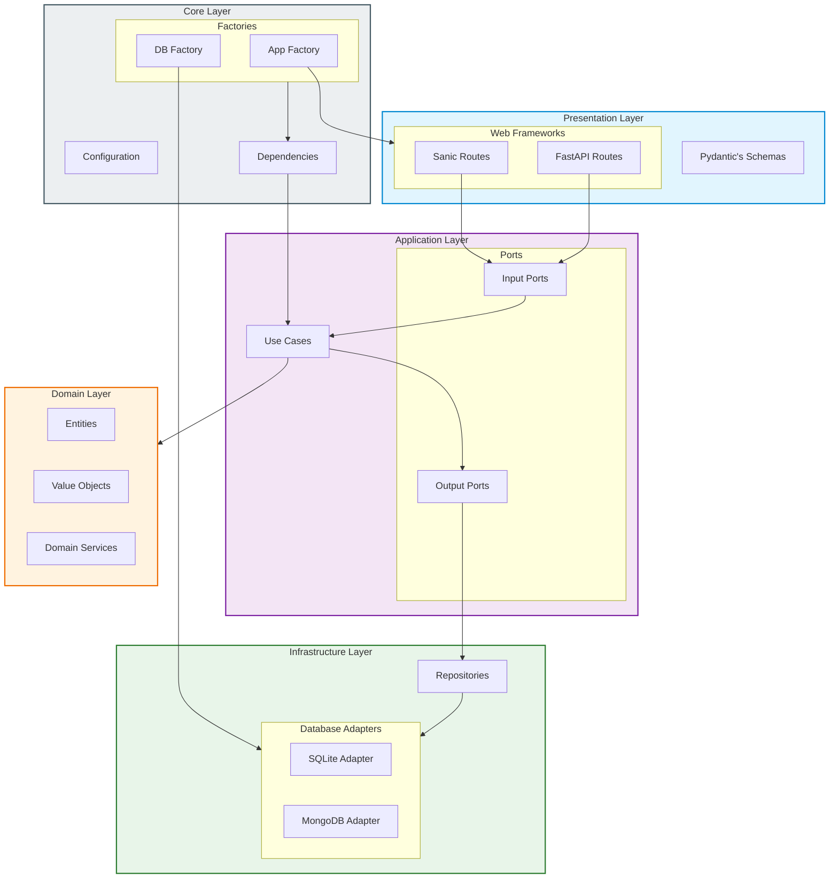
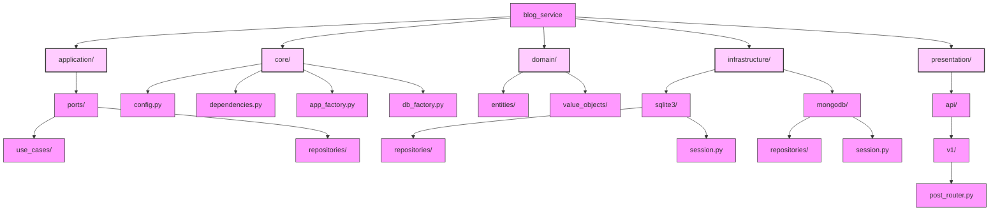

# Blog Service

A flexible blog service built with Hexagonal Architecture, supporting multiple web frameworks and databases.

## 🛠️ Features

- Multiple web framework support:
  - FastAPI
  - Sanic
- Multiple database support:
  - SQLite
  - MongoDB
- Hexagonal Architecture
- Development mode with auto-reload
- Rich CLI interface

## 📋 Requirements

- Python 3.8+
- Poetry for dependency management

## 🚀 Installation

1. Install Poetry (if not already installed):
```bash
curl -sSL https://install.python-poetry.org | python3 -
```

2. Clone the repository:
```bash
git clone <repository-url>
cd blog_service
```

3. Install dependencies:
```bash
poetry install
```

## 💻 Usage

The blog service can be run with different configurations using the CLI:

### View Help
```bash
poetry run blog --help
```

### Basic Run
```bash
# Run with default settings (FastAPI + SQLite)
poetry run blog run

# Run with custom framework and database
poetry run blog run --framework sanic --db mongo

# Run with custom host and port
poetry run blog run --host localhost --port 8080
```

### Development Mode
```bash
# Run with auto-reload (FastAPI + SQLite)
poetry run blog dev

# Run with Sanic and MongoDB
poetry run blog dev --framework sanic --db mongo
```

### Command Options

- Framework (`-f, --framework`):
  - `fastapi` (default)
  - `sanic`

- Database (`-d, --db`):
  - `sqlite` (default)
  - `mongo`

- Host (`--host`):
  - Default: "0.0.0.0"

- Port (`-p, --port`):
  - Default: 8000

- Auto-reload (`-r, --reload`):
  - Enable hot-reloading for development

## 🏗️ Architecture

The project follows Hexagonal (Ports & Adapters) Architecture:



## 📁 Project Structure



## 📝 License

This project is licensed under the MIT License - see the LICENSE file for details.
